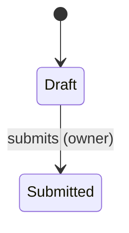

---
initiatives: [initiative-slug]
---

# Micro Job Template

> **House format.** Derived 2026-08-30 from four real filled Micro Job specs, the Product
> Development Workflow SOP (Chat 2 — the four questions, the mandatory flow-and-exception
> content, the four pressure tests, riskiest-assumption sequencing), the Terminology Proposal
> (Micro Job content model, Dev-Ready Bundle), the companion Jobs-to-be-Done document, and the
> BA Handoff package the finished spec has to feed. This file is the document contract:
> section order, table shapes and register rules come from here.
>
> **File name and location.** Keep the machine name: copy to
> `PRDs/{area}/{initiative-slug}-mj-{NN}-{job-slug}-micro-job.md` — the `-micro-job.md` suffix is
> how the repo finds it (`governance/link-schema.yaml`); `MJ-{NN}` is the house ID that Design,
> Engineering and the BA Handoff refer to. Fill the frontmatter above. For guided drafting run
> `/micro-job-draft`; it reads this file fresh every run. **Its section numbers — and its sweep
> lenses' — are the base template's, not this file's**: read the skill crosswalk in the rules
> comment at the bottom before folding anything into a numbered section here.
>
> **What this document is.** The buildable contract for ONE Micro Job — the level between the
> Product Brief (why this bet) and tickets (who builds what). A Micro Job is a discrete,
> buildable unit of work described entirely from the user's perspective, touching UI, logic and
> data end to end. It answers four questions: **what can the user do, when, why, and what rules
> apply.** It contains no UI language — no buttons, screens, fields or layouts. That detail is
> Design's to determine; use `[code-names]` for anything that needs a label.
>
> **Length and proportionality.** 1–3 pages. All core sections exist — a non-applicable one
> carries one line saying why, never a blank. Depth follows risk × novelty × variation count,
> never habit: an Integration Micro Job legitimately runs 1–2 pages with §§1–4 a line or two
> each, no fields table and an arrow-chain flow instead of a state diagram; a net-new stateful
> or high-risk job earns full depth. Conditional sections (rules comment at the bottom) appear
> only when their trigger fires.
>
> **Evidence labels.** Every load-bearing claim carries one — `[Evidenced]` (source named) ·
> `[Partial]` (signal, not proof) · `[Hypothesis — needs validation]`. Undecided capabilities
> are flagged, never invented. Honest unknowns are written out loud in the house form — "to be
> confirmed by Engineering before dev starts", "BA to extend during the deep dive" — paired
> with `[GAP: what's missing — how to close it]` so automation can age them.
>
> **Voice.** Plain language, grade-6 reading level. Personas by role. Date everything
> (YYYY-MM-DD). Rules are stated as behavior, not as intent.
>
> `>` blockquotes are guidance to the drafting agent — never emitted into the document.

---

MICRO JOB  |  [ORG]  |  [Product / module] [Release]

# MJ-[NN] — [Micro Job name]

[One line: what changes for the user because this exists.]

| Field | Detail |
|-------|--------|
| **Micro Job** | MJ-[NN] |
| **Type** | Integration / Net new / Enhancement |
| **Product / module** | [module] |
| **Release** | [Value Package, and Milestone if the VP ships in parts] |
| **Initiative** | [name — link to `product/initiatives/{slug}.md`] |
| **Parent documents** | [VP Product Brief](link) · [Micro Jobs Breakdown](link) |
| **Dev-Ready Prototype** | [link once Design has built it — "not yet built" until the Translation Checkpoint] |
| **Problem Statement it serves** | [the JTBD / Problem Statement from the breakdown] |
| **Date** | [YYYY-MM-DD] |
| **Effort** | [Engineering to confirm — sizing is theirs, not the PM's] |
| **Priority — why** | [stated in dependency or risk language, never a bare label] |
| **Dependencies** | [what must be live or confirmed before this starts — detail in §17] |
| **Status** | Draft / Agreed / Handed off |

> **Meta rules.** **Type** comes from the breakdown row and is verified against what the code
> actually does, not from hope. **Effort** is Engineering's number — the PM never fills a
> guess here; a range arrives from §15. **Priority** always carries its reason ("Must ship
> first — MJ-02 and MJ-03 depend on [surface] being live"), never a bare Must/Should.
> **Status** lives here, never in the frontmatter (that carries links only): `Draft` on
> creation → `Agreed` once all four pressure tests pass and the PM agrees the spec — the state
> the house calls **locked** → `Handed off` once the Dev-Ready Bundle actually goes to the BA.
> Each move updates the same three places in one change: this cell, the breakdown's MJ-row, and
> a dated Activity line on the initiative page, with **Date** bumped.

---

## 1. DESCRIPTION

**Why this exists**

[The root cause, not the pitch: what is broken or missing today, with current-state facts —
verified against the code where possible ("the flag already exists in [module]; it just isn't
visible here"). One or two paragraphs.]

**What this Micro Job does**

[What is being built or surfaced. For an Integration job, say plainly which components already
exist and that this is the integration and configuration work to surface them correctly.]

**The outcome**

[The change in what people DO — not the thing shipped. "Approvals get cleared the same day,"
not "an approvals screen."]

---

## 2. USER STORY

As a [persona], when I [situation], I want to [motivation], so that I can [outcome].

> Intent only — the middle clause is never a UI action. One primary story here; per-variation
> stories go in §4 only when they materially differ. Where the parent Problem Statement is
> quoted, use its house sentence form: *"When I [situation], I want to [motivation], so I can
> [expected outcome]."*

---

## 3. THE SLICE

> A Micro Job is one thin, end-to-end slice of the Value Package — vertical by definition.
> Four facts, no more.

**Riskiest assumption this job tests:** [the thing we most need to find out]
**The backbone (full flow, for context):** [stage] → [stage] → [stage] → [outcome lands]
**What this slice covers:** [where it starts, where it ends, that the loop closes — or why it deliberately doesn't]
**Preconditions & inherited dependencies:** [what must be live before this starts]

---

## 4. VARIATIONS — WHO DOES THIS DIFFERENTLY

> **Mandatory verdict, never silence.** Either the one-line verdict — "No material variations
> (checked: company size, vertical, org complexity, plan/package, region & compliance,
> data/integration maturity, persona, permission scope, tenure, language, accessibility needs,
> first-run vs steady-state, volume, timing/seasonality, migration state)" — or the table.
> Dispositions: **nuance** (same flow — becomes variation-tagged rules and exception rows) ·
> **branch** (a step materially differs — a delta sub-flow below the table, the delta only) ·
> **different job** (backbone differs end to end — flagged back to the breakdown as its own
> Micro Job, never absorbed here). Reach is sourced, not guessed.

**Variation verdict:** [either the one-line "No material variations (checked: [the dimensions swept])" — and then no table — or "Material variations found — dispositioned in the table below."]

| Variation | Who (reach, sourced) | Differs how | Priority — grounded | In this job? |
|-----------|----------------------|-------------|---------------------|--------------|
| [name] | [segment · N accounts / $ARR · source] | [nuance / branch / different job — one line] | [tier — reason] | [yes / deferred → MJ-NN] |

---

## 5. HAPPY PATH

> The primary, intended end-to-end flow — everything works, the user completes the task with no
> errors and no alternative routes. **Fully described. This is the core of the spec.** What each
> actor must be able to do and where each action leads; places, things to act on, consequences.
> Nothing visual. A new object gets a fields table; a stateful object gets ONE simple state
> diagram (states and who moves them; no styling, no nested regions). Close with the
> flagged-not-invented line.

**Places:** [where the user can be]
**Actions:** [what they can act on, described by intent]
**Where each action leads:** [what each action causes]

**The flow, step by step:**

1. [Step — what the user does]
2. [Step — what the system does in response]
3. [Step — where the outcome lands]

**[Object] fields** (only when this job introduces a new object):

| Field | What it is | Required / derived / system-set |
|-------|------------|---------------------------------|

**Capabilities this job does not answer — flagged, not invented:** [the undecided ones, carried as open questions in §14]

---

## 6. ALTERNATE FLOWS

> Secondary but valid routes through the same Micro Job — expected variations in how users
> complete the job, **not** errors. If a user can reach the same outcome three ways, each is an
> alternate flow. **These are built.** All of them named and described; a spec with none says so
> explicitly. Branches identified in §4 land here as the delta only, tagged with their
> variation.

| # | Alternate flow | When it is taken | How it differs from the happy path | Variation |
|---|----------------|------------------|------------------------------------|-----------|
| A1 | [name] | [trigger or situation] | [the delta only — where it rejoins the happy path] | [— or variation tag] |

---

## 7. ROLES & PERMISSIONS

> Persona × action matrix, including every out-of-scope persona and what they get — nothing,
> read-only, or an explanation. A persona difference with no system carrier (see
> `business-context/platform-model.md`) becomes a rule in §8 naming the mechanism; the build
> cannot guess it.

| Action | [Persona A] | [Persona B] | [Out-of-scope persona] |
|--------|-------------|-------------|------------------------|

---

## 8. RULES & ACCEPTANCE CRITERIA

> **Two registers only.** **Rules** R-1…R-n — one behavior each, with an explicit trigger and
> state, each carrying *— Why:*. **Acceptance criteria** as checkboxes under the house lead-in
> below — Given/When/Then for conditional behavior, flat assertions for simple invariants.
> **The Then is a system state or a user-visible result, never a widget.** Variation-tagged
> wherever §4 requires it. No placeholder acceptance criteria — an unwritten AC blocks the
> handoff.

**Rules:**

- **R-1** — [one behavior, explicit trigger and state]. — *Why:* [reason]
- **R-2** — [one behavior]. — *Why:* [reason]

**Acceptance criteria**

This Micro Job is complete when all of the following are true:

- [ ] Given [context], When [action], Then [observable result or system state]
- [ ] [flat assertion for a simple invariant]
- [ ] [permission assertion — who can and cannot do this]
- [ ] [empty-state assertion — what happens when there is nothing to show]
- [ ] Accessibility checks pass on supported browsers

---

## 9. CONSTRAINTS

> The non-negotiables a build cannot guess: compliance, money, audit, localization, data
> integrity, retention. Each a rule plus a reason, labeled with its domain and an evidence
> label. Cite `business-context/platform-model.md` and `engineering/tech-constraints.md`; a
> presumed-constraint domain stays a constraint until its owner says otherwise.

- **[domain]** — [rule]. — *Why:* [reason]. `[Evidenced]`

---

## 10. CROSS-CUTTING CONCERNS

> Every row answered — **in this job** (budgeted scope) or **deferred** (named risk + which
> later Micro Job picks it up). Silence is the only wrong answer.

| Dimension | In this job? | If deferred — risk + where it goes |
|-----------|--------------|-------------------------------------|
| Accessibility (keyboard, screen reader, color) | | |
| Localization — UI + system text | | |
| Notifications at every handoff | | |
| Audit & history (who / what / when) | | |
| Day-one & existing data (defaults / migration / empty states) | | |
| Permission-denied & out-of-scope personas | | |
| Plan / packaging eligibility | | |
| Limits, quota & idempotency | | |
| Timezone & calendar | | |

---

## 11. NAMED EXCEPTIONS

> Known error and failure states the system must handle gracefully — "what happens when a
> required field is missing?" **The PM initiates this list; the BA extends it with
> implementation-level exceptions during the deep dive** (database constraints, API
> limitations, legacy system quirks), so it is expected to be incomplete — say so. Describe the
> outcome that must hold, never the UI that shows it. The columns below are the shape the BA
> Handoff consumes; fill Source as PM and leave the BA's rows to them.

**PM-initiated list, expected to be incomplete — the BA extends it during the deep dive with implementation-level exceptions:**

| # | Exception | Trigger condition | What must be true | Compliance rule | Flags for BA | Source |
|---|-----------|-------------------|-------------------|-----------------|--------------|--------|
| E1 | [short name] | [the situation that causes it] | [the outcome that must hold] | [rule, or None] | [the open question the BA should settle] | PM |

---

## 12. EDGE CASES

> Unusual or extreme scenarios at the boundary of expected behavior. **Named so Engineering
> knows they exist and can plan** — not required to be fully specified or built upfront. This
> is the honest difference from §11: an exception must be handled, an edge case must be known.

| # | Edge case | Why it is at the boundary | Build now? |
|---|-----------|---------------------------|------------|
| EC1 | [scenario] | [what makes it extreme — volume, timing, data shape, concurrency] | [named only / handle defensively / in scope] |

---

## 13. SCOPE PRIORITIES & GROUNDING

> What's in versus deferred, and why — grounded, never opinion. **Reach** = accounts / ARR /
> users affected, a named number with its source (`segmentation-matrix.md`, `portfolio.yaml`,
> analytics). **Frequency** = how often it bites for those affected. **Severity**: compliance,
> money, privacy or irreversibility auto-escalate to Must regardless of reach. **Effort is
> deliberately not scored** — it is Engineering's number (§15). Unevidenced Reach or Frequency →
> tier marked *provisional* plus a research row in §14. This table sets the job boundary; build
> order lives in the breakdown.

| Item | Reach (sourced) | Frequency | Severity | Evidence | Tier | In / deferred → where |
|------|-----------------|-----------|----------|----------|------|-----------------------|

---

## 14. OPEN QUESTIONS & RESEARCH NEEDED

> Every open question, provisional priority and unverified assumption gets an owner and a
> best-method route: interviews → `/interview-guide` (suggested, never auto-run) · existing
> corpus → `/user-research-synthesis` or a direct read · reach and baselines →
> `segmentation-matrix.md` / analytics · competitors → `/competitor-analysis` · feasibility →
> `/code-qa` or `[TODO: eng consult]`. Questions are about the need, never the UI.
>
> Ranked by **Priority**, highest first — this is the job's hypothesis backlog, not a parking
> lot. Priority is the answer-first rank (1 = answer first), not §13's tier. `#` is a stable row
> id other sections cite (*§14 #3*), so it never re-numbers on a re-rank. **Risk lens**, one per
> row: Desirability / Viability / Feasibility / Usability. **Confidence** is inherited from the
> §13 (or §9) row the question traces to, by its evidence label — `[Evidenced]` → High ·
> `[Partial]` → Med · `[Hypothesis — needs validation]` → Low; no labelled source row → Low.
> Job-level only: bet-level hypotheses live in the Product Brief — link, don't restate.

| # | Question / assumption | Risk lens | Confidence | Priority | Blocks | Owner | Best method → route | Status |
|---|-----------------------|-----------|------------|----------|--------|-------|---------------------|--------|

---

## 15. ENGINEERING CONFIRMATIONS NEEDED

> What Engineering answers before scope and priorities are committed. The house's strongest
> recurring pattern belongs here: when a capability already exists elsewhere in the product,
> say so and say it plainly — *"already live in [module] (prior project). Engineering to confirm
> the same endpoint is consumed here — do not re-implement. Endpoint name and field reference to
> be documented before dev starts."* Confirmed answers get folded into
> `engineering/tech-constraints.md`.

- [ ] [endpoint / component existence — the do-not-re-implement class]
- [ ] [atomic-transaction question: do all steps succeed or none commit? — a read-only job answers "not applicable: this job writes nothing", and that answer is recorded, not omitted]
- [ ] [data migration / existing-data question]
- [ ] Effort range for each Must-tier item

---

## 16. TELEMETRY PLAN — HOW WE'LL KNOW IT WORKED

> What gets instrumented at the Micro Job level so the KPI Framework can actually be measured.
> This is the block the Dev-Ready Bundle carries; the Product Brief's KPI Framework is the
> business-level frame above it — link, don't restate. Deep-dive: `/feature-metrics`.
>
> **A threshold with no baseline is an invented number.** Where analytics carries no baseline for
> a metric, name the metric, its direction and its window, and defer the figure in the house form
> — `[GAP: threshold unset — no baseline; [who] sets it from [source] before [when]]` — rather
> than writing a plausible one. A deferred threshold is a complete answer; a guessed one is not.

**1. Events to fire**

| Event | When it fires |
|-------|---------------|
| [event_name_in_snake_case] | [the user or system action that fires it] |

**2. Success metric**

[This Micro Job is working if [measurable statement with a threshold and a window] — and what
that would mean. No baseline for the threshold → state the metric, direction and window, and
defer the figure: `[GAP: threshold unset — no baseline; [who] sets it from [source] before [when]]`.]

**3. Kill metric**

[Pause and investigate if [measurable statement with a threshold and a window] — and what that
would tell us. The same deferral form applies when no baseline exists.]

**4. Leading and lagging indicators**

*Leading — check [Day N]:*
- [If [event] is low, [what that suggests]]

*Lagging — check [Day N]:*
- [The behavior-change read: is this part of their routine?]
- [The guardrail: what must not get worse]

**Riskiest-assumption tie-in:** [how these signals confirm or kill §3's riskiest assumption]

---

## 17. DEPENDENCIES & NOTES

[Everything this job needs to be true before it starts, in full: prior Micro Jobs and what
specifically must be live from each, existing components assumed present, endpoints and
templates to be confirmed with Engineering or another team, and any note about direction the
build would otherwise get wrong. This is the expanded version of the meta table's Dependencies
row — one place, so nothing lives only in a table cell.]

---

## 18. EXCEPTION LIST — WHAT'S OUT OF SCOPE

> The house artifact that travels in the Dev-Ready Bundle: **one entry per locked Micro Job**,
> each naming the excluded item and briefly why. Every exclusion names its future Micro Job (or
> "deliberately never, because…") and why later beats now. §4's different-job flags and §10's
> deferrals land here. When in doubt whether something is in or out, the house default is out —
> it is easier to add scope later than to manage scope creep mid-build.

**Exclusion verdict:** [either one line naming what the table below excludes — or, plainly, "Nothing was considered and excluded: this Micro Job's boundary is the whole of it," and then no table.]

| Excluded item | Why it is out | Where it goes | Consider for |
|---------------|---------------|---------------|--------------|
| [item] | [reason] | [MJ-NN / a future Value Package / deliberately never] | [release, or —] |

---

**Definition of done**

- All acceptance criteria above are met.
- Code reviewed and approved.
- QA sign-off complete on supported browsers.
- Accessibility check passed.
- Deployed to staging and verified.
- Product Manager sign-off received.

**Pressure test** — all four must pass before this Micro Job is locked (`Status: Agreed`):

| Test | What it checks | Result |
|------|----------------|--------|
| Before/After | Is there a clear difference in what the user can do before and after this exists? | Pass / Fail — [why] |
| Standalone | Could this be built and released on its own once the preconditions declared in §17 are live? A declared dependency is not a Fail. | Pass / Fail — [why] |
| Vertical/Horizontal | Does it go end to end through one user experience, rather than cutting across several? | Pass / Fail — [why] |
| Scope sanity | Is the scope achievable in a reasonable build cycle — not a whole initiative, not too small to deliver value? | Pass / Fail — [why] |

> A Micro Job failing the same test three or more times is a scoping problem, not a writing
> problem — flag it with the PM Lead before continuing.

**Evidence & traceability:** Problem Statement this serves: [link] · Product Brief goal: [link]
· Sources this spec leans on: [links]

**Quality gate** (the single checklist — checked by `/micro-job-draft` before presenting; recheck on manual edits):

- [ ] All four pressure tests pass, with their reasons recorded above
- [ ] Answers the four questions: what can the user do · when · why · what rules apply
- [ ] Altitude: no visual design, copy, component choice, implementation-how, or effort numbers; UI nouns only for existing platform surfaces or `[code-names]`
- [ ] No widgets in any Then
- [ ] Every capability has ≥1 rule or AC behind it; no placeholder acceptance criteria
- [ ] Happy path fully described; every alternate flow named; every named exception given an outcome; every edge case labelled
- [ ] Every state in §5's diagram is reachable and exitable, with a named mover
- [ ] Every §10 row answered; §11 says explicitly that the BA will extend it
- [ ] Every §4 variation dispositioned (nuance / branch / different job / not material)
- [ ] Every §13 priority grounded in a sourced number, or marked provisional with a §14 row
- [ ] Every §14 row carries a lens, a confidence, a priority, an owner and a route, ranked highest-first; §15 lists what Engineering must confirm
- [ ] §16 telemetry names events, a success metric, a kill metric, and leading/lagging reads
- [ ] §18 carries at least one entry, or states plainly that nothing was considered and excluded
- [ ] Ambiguity lint: no bare "should", "fast", "easy", "handle", "appropriate", "etc." as requirement language (§13's Must/Should/Could tier labels and §12's `handle defensively` disposition are vocabulary, not violations)
- [ ] Traces to a named Problem Statement and a Product Brief goal; nothing invented where evidence is absent — flagged instead

<!--
Template rules (template file only — delete this comment when filling a copy):
- Conditional sections — add ONLY when the trigger fires, placed after the section that feeds them:
  · Definitions (after the one-line summary) — the job introduces novel terms. The house
    convention is a "Words used in this document" table, each term defined the first time it appears.
  · Committed solutions (after §9) — a mechanism the team has genuinely agreed is the only viable
    path, each stamped: serves capability · why the only path · agreed by · date. Rare — the
    default is a capability, not a commitment.
  · Risks & break points (after §12) — high-risk job: irreversibility, money, or privacy,
    including authority over money movement. The house marks these in the meta Priority cell too
    ("highest-risk job — allow extra QA time") and requires the atomic-transaction question in
    §15 to be answered before dev starts — "not applicable: this job writes nothing" is a valid
    answer for a read-only job (a privacy-triggered job often is one), and it is recorded, not
    dropped.
  · Competitive notes (after §13) — a market sweep ran (`/micro-job-draft --market`).
  · Handoff note (at the very end) — handoff to the BA is imminent.
- The Dev-Ready Bundle is four artifacts: the Dev-Ready Prototype (Designer-built, after the
  Translation Checkpoint) + this spec + the Exception List (§18) + the Telemetry Plan (§16).
  This template carries three of the four; the prototype is linked from the meta table.
- Status vocabulary: the meta cell reads Draft / Agreed / Handed off — the machine values the
  breakdown's MJ-row and `/micro-job-draft` write. "Locked" is the house word for Agreed: all four
  pressure tests passed and the PM agreed the spec.
- Living doc: edit in place, bump Date. Challenge reports live in `PRDs/{area}/reviews/`,
  never inside this file.
- The section order IS the method's spine (why → story → slice → variations → happy path →
  alternate flows → roles → rules → constraints → cross-cutting → exceptions → edge cases →
  priorities → research → engineering → telemetry → dependencies → exception list).
  Skills follow it; don't re-order per job.
- Skill crosswalk — READ BEFORE FOLDING ANYTHING INTO A NUMBERED SECTION. `/micro-job-draft` and
  its sweep lenses (`.claude/skills/micro-job-draft/references/`) number sections from the base
  template, not this house file: this file merged the base §§1–2 into §1, split the base's single
  flow section (§6) into §5 HAPPY PATH + §6 ALTERNATE FLOWS, inserted §12 EDGE CASES, and added
  §17 DEPENDENCIES & NOTES (the base kept preconditions inside its slice section). Map every
  reference through this table:
    base §1–2 → §1 · §3 → §2 · §4 → §3 · §5 → §4 · §6 → §5 and §6 ·
    §7, §8, §9, §10, §11 → unchanged · §12 → §13 · §13 → §14 · §14 → §15 · §15 → §16 · §16 → §18.
  So: the variation verdict fills §4; the state diagram and the flow the situation sweep walks
  live in §5; research rows go to §14; engineering confirmations (including the atomic-transaction
  question) to §15; analytics baselines and the metric plan to §16; deferrals and different-job
  flags to §18. Step 6's `[TODO: feasibility unverified]` and the platform-model /
  tech-constraints `[GAP:]` lines stay in §9 — base §9 and house §9 are both CONSTRAINTS.
-->
